# SQL-Finance-and-Supply-Chain-Analytics

## Project Overview
The company is facing performance issues as the size of Excel files has been increased. To solve the issue company has formed a team of data analysts who will be using MySQL to gain insights which are valuable for the company

## Problem Statement
For this project, I will Analyze the dataset provided by AtliǪ Hardware and will extract valuable insights related to sales, market, customer and supply chain forecasting.

## Financial Analytics
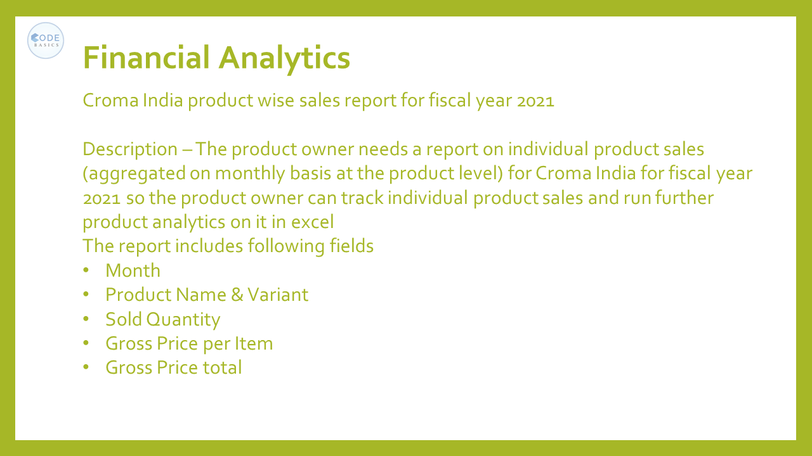

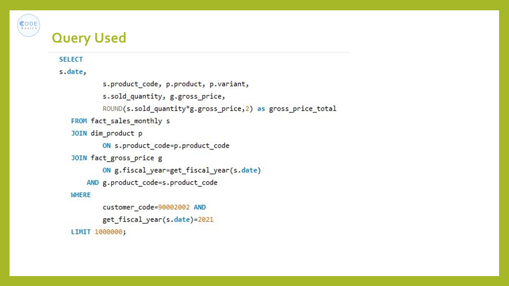

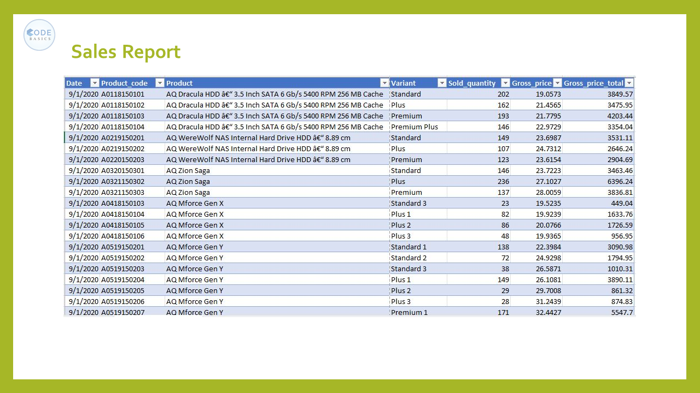

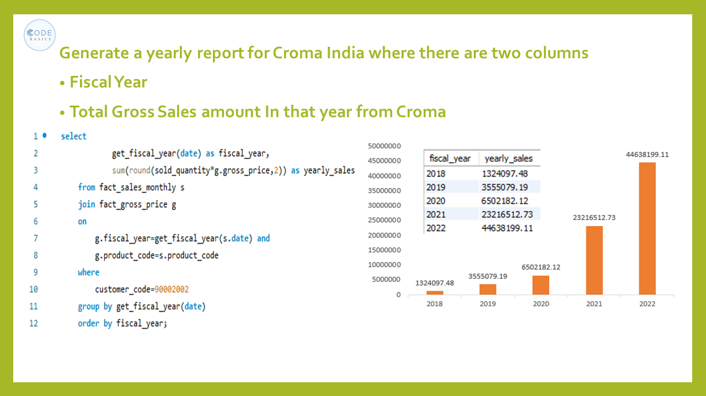

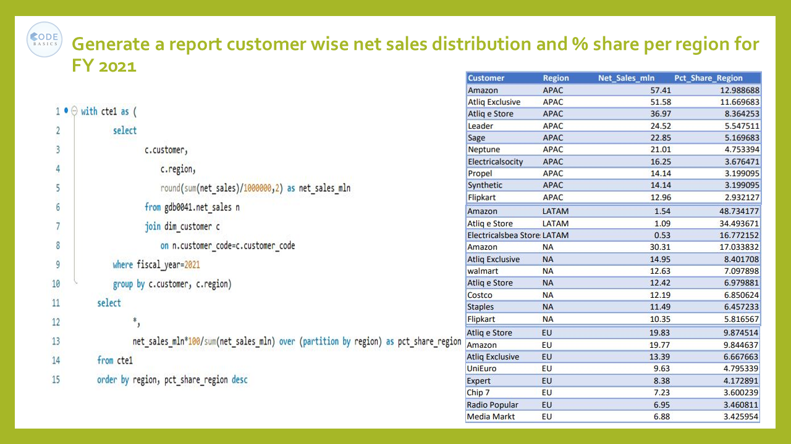

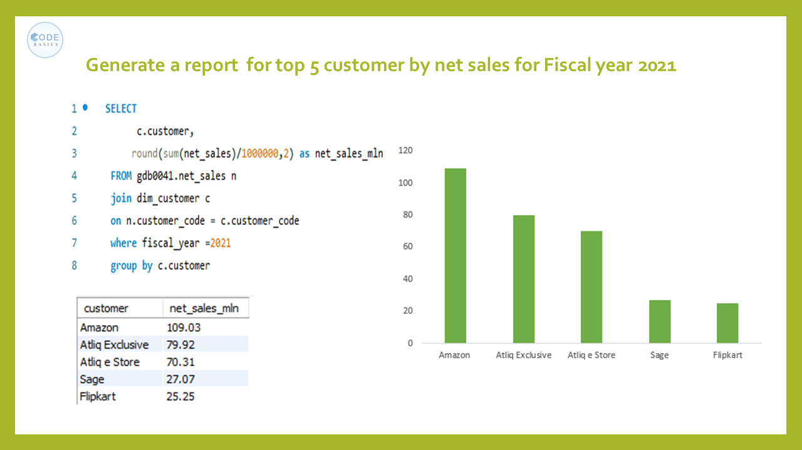

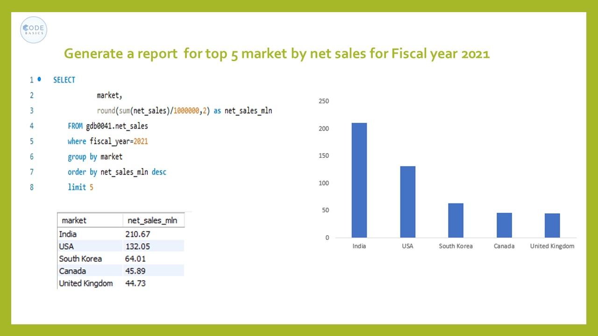

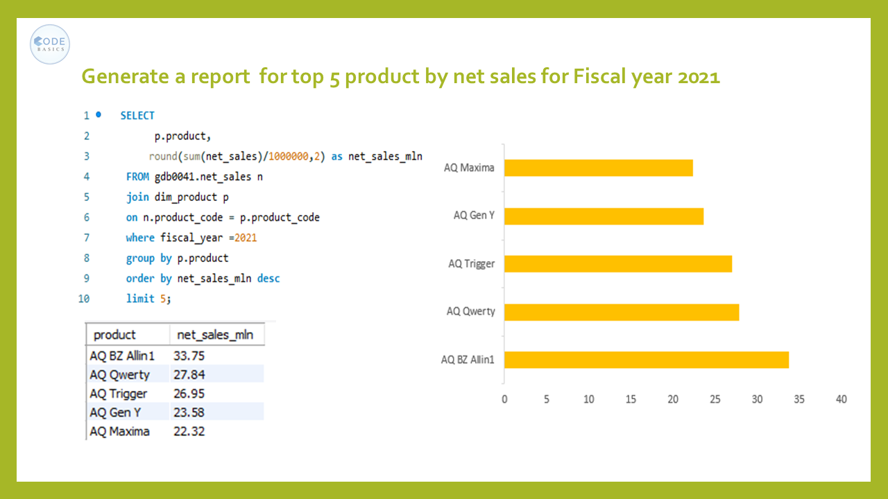

## Supply Chain Analytics

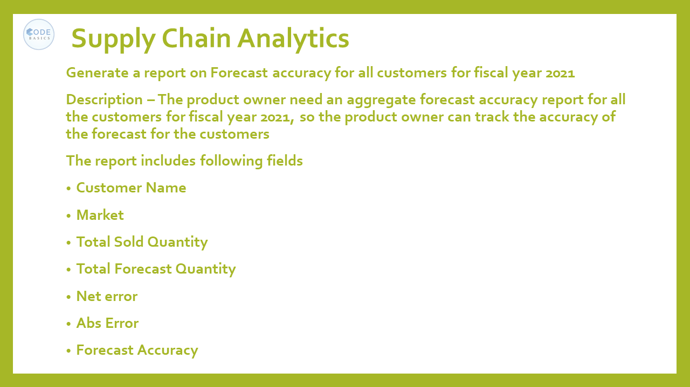

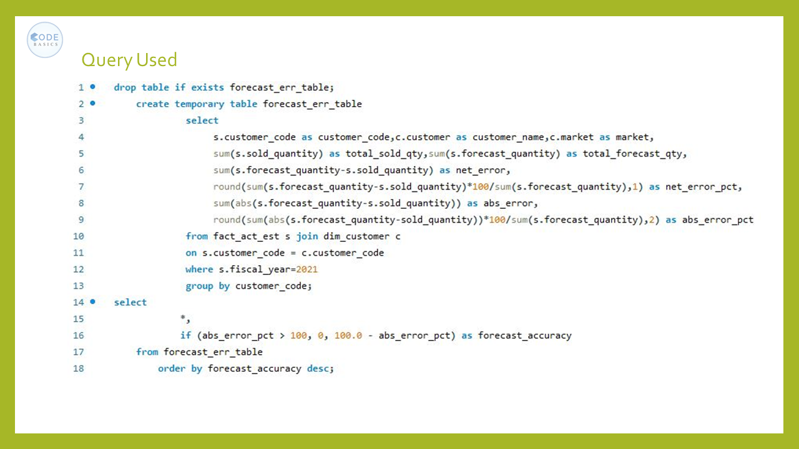

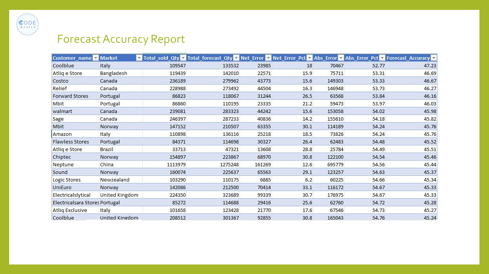

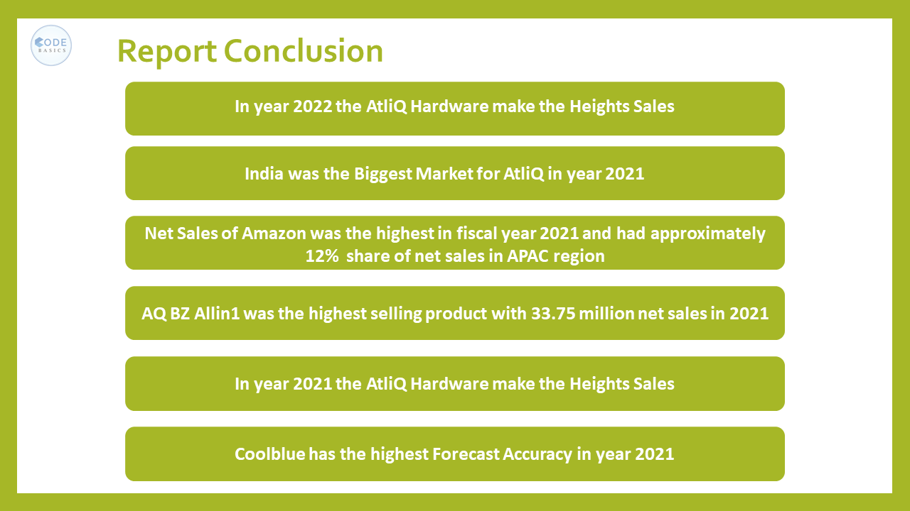

